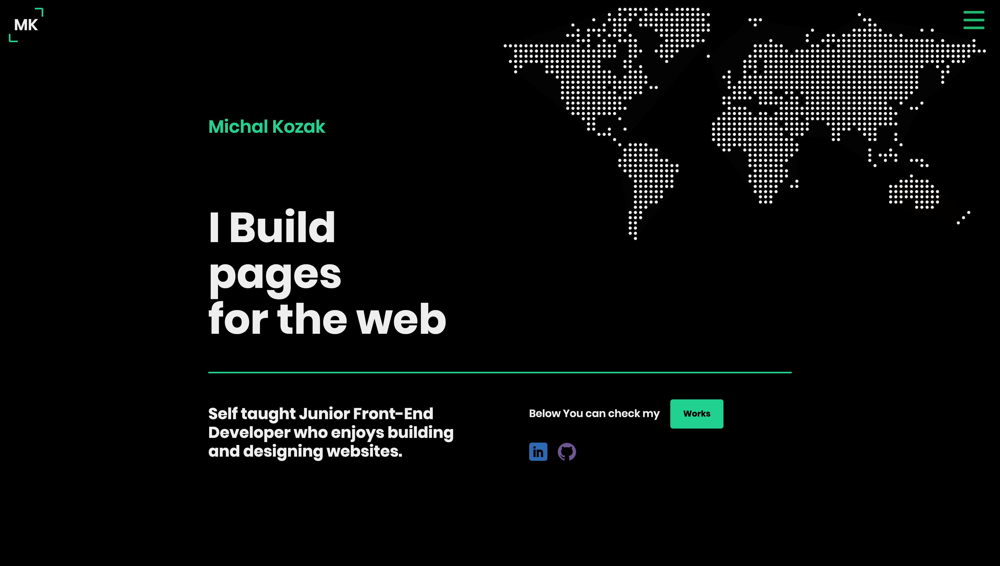
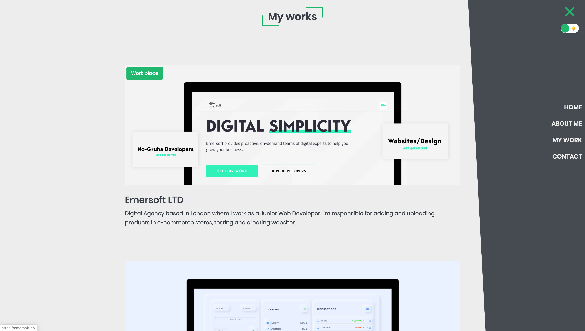

<!-- [![MIT License][license-shield]][license-url] -->

[![LinkedIn][linkedin-shield]][linkedin-url]

<br />
  <h1 align="center">Portfolio</h1>

  <p align="center">
    <br />
    <a href="https://kzkmichal.github.io/Portfolio/">View Live</a>
  </p>
</p>

<!-- TABLE OF CONTENTS -->

## Table of Contents

- [About the Project](#about-the-project)
  - [Project Overview](#project-overview)
  - [Screeenshots](#screenshots)
  - [Built With](#built-with)
- [Getting Started](#getting-started)
  - [Installation](#installation)
  - [Available Scripts](#available-scripts)
- [Contact](#contact)

<!-- ABOUT THE PROJECT -->

## About The Project

### Project Overview

<p>

My portfolio, which contains existing projects created by me
and the workplace[Emersoft](https://emersoft.co/) where I get my first experience as a Junior Web Developer

</p>

### Screenshots

<p align="center">
    
</p>

<p align="center">
    
</p>

### Built With

- SASS
- GULP 4
- JS (ES6)
- Figma

<!-- GETTING STARTED -->

## Getting Started

### Installation

1. Clone the repo

```sh
git clone https://github.com/kzkmichal/Portfolio
```

2. Install NPM packages

```sh
npm install
```

### Available scripts

| Command      | Description            |
| ------------ | ---------------------- |
| `gulp dev`   | Open local server      |
| `gulp build` | Create optimized build |

<!-- CONTACT -->

## Contact

Email [kozakmichal48@gmail.com](mailto:kozakmichal48@gmail.com)

Github: [https://github.com/kzkmichal](https://github.com/kzkmichal)

Project Link: [https://github.com/kzkmichal/Portfolio](https://github.com/kzkmichal/Portfolio)

<!-- MARKDOWN LINKS & IMAGES -->
<!-- [license-shield]: https://img.shields.io/github/license/othneildrew/Best-README-Template.svg?style=flat-square
[license-url]: https://github.com/othneildrew/Best-README-Template/blob/master/LICENSE.txt -->

[linkedin-shield]: https://img.shields.io/badge/-LinkedIn-black.svg?style=flat-square&logo=linkedin&colorB=555
[linkedin-url]: https://www.linkedin.com/in/michal-kozak-7a881013b/
